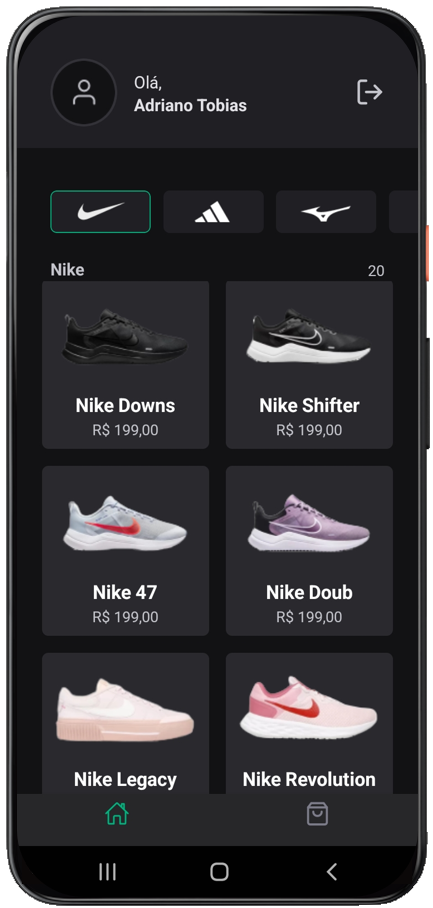
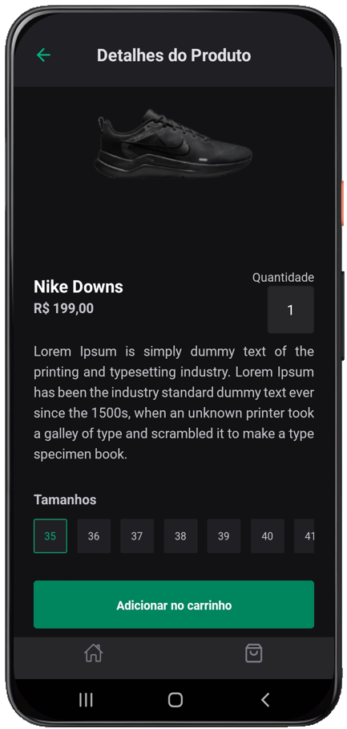
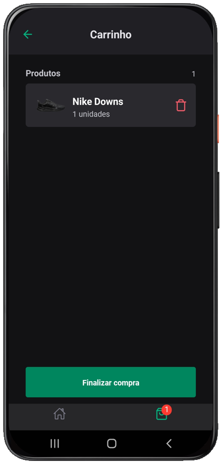

# Ignite Shoes

<p align="center">
  
  
  
</p>

<br>

## 💻 Projeto

**[Ignite Shoes](https://github.com/AdrianoTobias/igniteshoes)**, é uma aplicação mobile com o framework Expo, voltada a marketplace de calçados, utilizada para o aprendizado de push notification e deep linking.

É uma aplicação desenvolvida durante o **[MBA Fullstack](https://www.rocketseat.com.br/mba)**, provido pela **[Rocketseat](https://rocketseat.com.br/)**, em parceria com a **[Sirius Education](https://landing.sirius.education/home/)**.


## 🧪 Tecnologias

Esse projeto foi desenvolvido com as seguintes tecnologias:

- [React Native](https://reactnative.dev/)
- [Expo](https://expo.dev/)
- [TypeScript](https://www.typescriptlang.org/)


## 🚀 Como executar

Clonar o projeto e acessar a pasta do mesmo:

```bash
$ git clone https://github.com/AdrianoTobias/igniteshoes.git
$ cd igniteshoes
```

Para iniciá-lo:
```bash
# Instalar as dependências
$ npm install
```

```bash
# Iniciar a aplicação em Android
$ npx expo run:android

# Iniciar a aplicação em iOS
$ npx expo run:ios
```
A aplicação poderá ser acessada via dispositivo (físico ou emulador), através do [Expo](https://docs.expo.dev/more/expo-cli/#building).


[Adriano Tobias](https://github.com/AdrianoTobias)